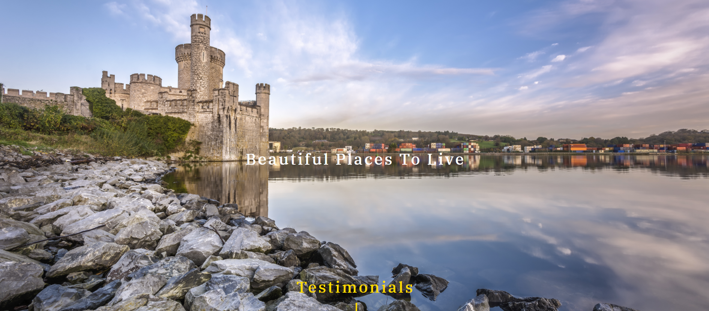

# **Keane Mahony Smith**

[View Live Project here](https://keane-mahony-smith.herokuapp.com/)

<h2 align="center"></h2>

This was an exciting project for me as it was the first professional website I developed as a free lance developer after graduating from [Code Institute](https://codeinstitute.net/). 

[Keane Mahony Smith](http://www.keanemahonysmith.ie/) is an established auctioneering firm based in Cork City. Their previous website was a templated website which was very limited and lacked its own unique style. [Darragh Taaffe](https://www.linkedin.com/in/darragh-taaffe-232745154/) of Keane Mahony Smith's main brief of the new website was to be unique and edgy so it stood out from the industry normal mundane real estate/ auctioneer websites.

The website was built using the [Django Framework]( https://www.djangoproject.com/start/overview/) as it was ideal to build a centrally-owned dataset to handle all the properties listed for sale.

## **User Experience (UX)**

-   ### User Stories

    - As a Seller 

    - As a user i want to read an 'about section', so i can get a feel for the type of company and brand KMS is and what makes them different from other auctioneers. 
        - Reason for 'About' section on Homepage.

    - As a user I want to see the different services KMS offers as some auctioneers specialize in specific services eg. rental's only or property management etc
        - Reason for 'Services' section which highlights that KMS works with residential, commercial and land sales only. 
    
    - As a user I want to read some testimonials from clients who have dealt with KMS in the past.
        - Reason for 'Testimonials' section. 

    - As a user I want to see some of the properties KMS have sold in the past, in order to get a better insight into the type of houses they sell and the price they achieved for that sale. 
        - Reason for having not only the properties for sale but also the properties KMS have 'sold in the past and the properties that are 'sale agreed'. 

    - As a user i want to understand the process of a house sale. 
        - Reason for 'Selling Guide'

    
    - As a Buyer

        - As a user i want to be able to see all the properties for sale. 
            - Reason for 'Properties' page. 

        - As a user i want to be able to filter my search so i can narrow my set of properties to ones which are more specific to me. 
            - Reason for filtered search. 

        - As a user i want to be able to get a detailed insight into each property.
            - Reason for 'Property Selected' page. 

        - As a user i want to get in contact with KMS or one of their agents. 
            - Reason for 'Contact Page', 'Meet the Team' section.

        - As a user i want to see the exact location of the property so i can get a better understanding for the services in the locality. 
            - Reason for Google Maps API. 

    - As an Owner 

        - As the owner of KMS i want a website that is unique and stands out from my competitors. 
            - Reason for a colour scheme that remains constant throughout the website. Imagery is used across the website in order to interest and evoke emotion from the user. 
            - Use of slide carousel in order to add a sense of play to the testimonial and property images section.
    
-   ### **WIREFRAMES**

After speaking with Keane Mahony Smith and taking their requirements and needs into account I formulated a idea and jotted down notes and rough sketches on pen and paper. These ideas evolved into creating user stories which helped me formulate a plan to draw up some wireframes.
I used [Balsamiq](https://balsamiq.com/) to build the wireframe's. I created mockups for desktop, tablet and mobile view ports, so I could have an idea of what my website would look like, and I could follow a plan to avoid scope creep.

- Large Devices Wireframe  [view](Wireframes/KMS-WIREFRAME-LG.pdf)
- Ipad Devices Wireframe  [view](Wireframes/KMS-WIREFRAME-IPAD.pdf)
- Mobile Wireframe [view](Wireframes/KMS-WIREFRAME-MOBILE.pdf)

## **Design**

### Framework
I used Bootstrap 4 to build the framework of the website. Bootstrap was the main tool frame responsible for making the Keane Mahony Smith website responsive. This means the website automatically resizes itself to look good on all devices, be it mobile, tablet, laptop or desktop.

### Colour Scheme

- **Black** And **Yellow** - Black and yellow is the colours of the Keane Mahony Smith brand. At first i was contemplating using these colours subtly throughout the website as they are quite dominating colours. I decided to be brave and bold and use these colours for the majority of the homepage. I believe the colours work well and there is a sense of change with some sections having black text with yellow background and vice versa. 

- **White** - On some of the pages there is a white background as opposed to the dominant black. The reason being, I wanted to go for a clean look that doesn't distract the user. This is evident in the 'Properties' and the 'Property Selected' page where i wanted the details on each property to be the main focus of the user.

There are other colours used on the site but they are used for minor style touches. 

### Typography
The “IBM Plex Serif” font is the font used for all the headings and the “Open Sans” font is the font used for the body of the website. "Montserrat" is used for the branding over the hero image to give a sense of importance. Sans serif and serif is set as the fallback font in case for any reason these fonts aren't being imported into the site correctly.

### Imagery
Imagery is a reoccurring theme throughout the website. Imagery plays a vital role in the property industry. I used [Shutterstock]( https://www.shutterstock.com/home) for majority of the images as i felt clean top quality images was necessary to improve the quality of the website.

## **Layout**

### Homepage

The homepage sets out to be the most eye catching and enticing page of the website. The homepage clearly describes who Keane Mahony Smith are and what they are about. 

**Hero image** - Sets to eye catching a draw the user in. 

Hero Image <strong>(Click dropdown for images)</strong>

  </a>

  

**About Section** - I attempted to mirror a written letter to give this 'About' Section a authentic and personal feel.

About Section<strong> (Click dropdown for images)</strong>

  </a>

  

**Parallax Images** - These images are not in fact parallax, they simply give the feel of parallax by having a background attachment of fixed. The user is drawn in as the image is revealed as the scroll with the page. 

Parallax Images<strong> (Click dropdown for images)</strong>

  </a>

  </a>

  

**Our Services Section** - This section uses the [AOS](https://michalsnik.github.io/aos/) plugin to slide content as the user scrolls down. The images chosen feature the colours black and yellow to align with the colour scheme of the website. 

Our Services Section<strong> (Click dropdown for images)</strong>

  </a>

  

**Testimonials Section** - This section uses the [Slick Carousel](https://kenwheeler.github.io/slick/) plugin to add a sense of play as the user can slide between the different testimonials. 

Testimonials Section<strong> (Click dropdown for images)</strong>

  </a>

  

**Meet The Team** - This section the images are black and white and upon the user hovering on each individual card the image's full colour is revealed.

Meet The Team Section<strong> (Click dropdown for images)</strong>

  </a>

  

---
### Properties Page 

The Property Page simply includes bootstrap card decks to list all the properties for sale. 

Property Section <strong> (Click dropdown for images)</strong>

  </a>

  

**Django-Paginator** was used to limit each page to 15 properties so a user is not endlessly scrolling down the page to see all the properties. 

Pagination<strong> (Click dropdown for images)</strong>

  </a>

  

**Django-Filter** was implemented so users can filter their property search. 

Filter <strong> (Click dropdown for images)</strong>

  </a>

  

    
    