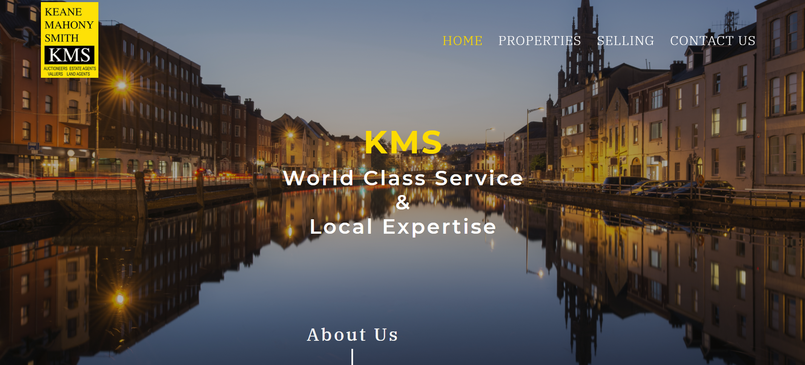
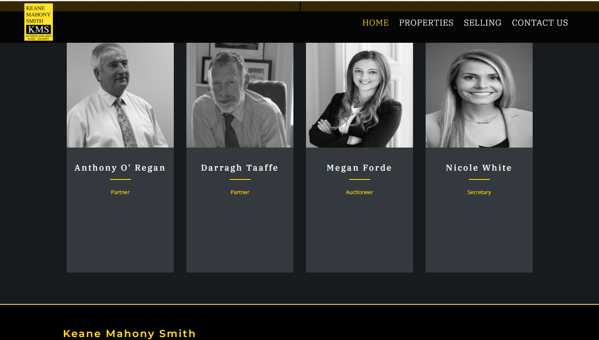

# **Keane Mahony Smith**

[View Live Project here](https://keane-mahony-smith.herokuapp.com/)

<h2 align="center"></h2>

This was an exciting project for me as it was the first professional website I developed as a free lance developer after graduating from [Code Institute](https://codeinstitute.net/). 

[Keane Mahony Smith](http://www.keanemahonysmith.ie/) is an established auctioneering firm based in Cork City. Their previous website was a templated website which was very limited and lacked its own unique style. [Darragh Taaffe](https://www.linkedin.com/in/darragh-taaffe-232745154/) of Keane Mahony Smith's main brief of the new website was to be unique and edgy so it stood out from the industry normal mundane real estate/ auctioneer websites.

The website was built using the [Django Framework]( https://www.djangoproject.com/start/overview/) as it was ideal to build a centrally-owned dataset to handle all the properties listed for sale.

## **User Experience (UX)**

-   ### User Stories

    - As a Seller 

        - As a user i want to read an 'about section', so i can get a feel for the type of company and brand KMS is and what makes them different from other auctioneers. 
        
        - As a user I want to see the different services KMS offers as some auctioneers specialize in specific services eg. rental's only or property management etc

        - As a user I want to read some testimonials from clients who have dealt with KMS in the past.

        - As a user I want to see some of the properties KMS have sold in the past, in order to get a better insight into the type of houses they sell and the price they achieved for that sale. 

        - As a user i want to understand the process of a house sale. 

    - As a Buyer

        - As a user i want to be able to see all the properties for sale. 

        - As a user i want to be able to filter my search so i can narrow my set of properties to ones which are more specific to me. 

        - As a user i want to be able to get a detailed insight into each property.

        - As a user i want to get in contact with KMS or one of their agents. 

        - As a user i want to see the exact location of the property so i can get a better understanding for the services in the locality. 

    - As an Owner 

        - As the owner of KMS i want a website that is unique and stands out from my competitors. 
    
-   ### **WIREFRAMES**

After speaking with Keane Mahony Smith and taking their requirements and needs into account I formulated a idea and jotted down notes and rough sketches on pen and paper. These ideas evolved into creating user stories which helped me formulate a plan to draw up some wireframes.
I used [Balsamiq](https://balsamiq.com/) to build the wireframe's. I created mockups for desktop, tablet and mobile view ports, so I could have an idea of what my website would look like, and I could follow a plan to avoid scope creep.

- Large Devices Wireframe  [view](Wireframes/KMS-WIREFRAME-LG.pdf)
- Ipad Devices Wireframe  [view](Wireframes/KMS-WIREFRAME-IPAD.pdf)
- Mobile Wireframe [view](Wireframes/KMS-WIREFRAME-MOBILE.pdf)

## **Design**

### Framework
I used Bootstrap 4 to build the framework of the website. Bootstrap was the main tool frame responsible for making the Keane Mahony Smith website responsive. This means the website automatically resizes itself to look good on all devices, be it mobile, tablet, laptop or desktop.

### Colour Scheme

- **Black** And **Yellow** - Black and yellow is the colours of the Keane Mahony Smith brand. At first i was contemplating using these colours subtly throughout the website as they are quite dominating colours. I decided to be brave and bold and use these colours for the majority of the homepage. I believe the colours work well and there is a sense of change with some sections having black text with yellow background and vice versa. 

- **White** - On some of the pages there is a white background as opposed to the dominant black. The reason being, I wanted to go for a clean look that doesn't distract the user. This is evident in the 'Properties' and the 'Property Selected' page where i wanted the details on each property to be the main focus of the user.

There are other colours used on the site but they are used for minor style touches. 

### Typography
The “IBM Plex Serif” font is the font used for all the headings and the “Open Sans” font is the font used for the body of the website. "Montserrat" is used for the branding over the hero image to give a sense of importance. Sans serif and serif is set as the fallback font in case for any reason these fonts aren't being imported into the site correctly.

### Imagery
Imagery is a reoccurring theme throughout the website. Imagery plays a vital role in the property industry. I used [Shutterstock]( https://www.shutterstock.com/home) for majority of the images as i felt clean top quality images was necessary to improve the quality of the website.

## **Layout**

### Homepage

The homepage sets out to be the most eye catching and enticing page of the website. The homepage clearly describes who Keane Mahony Smith are and what they are about. 

**Hero image** - Sets to eye catching a draw the user in. 

Hero Image <strong>(Click dropdown for images)</strong>

  </a>

  

**About Section** - I attempted to mirror a written letter to give this 'About' Section a authentic and personal feel.

About Section<strong> (Click dropdown for images)</strong>

  </a>

  

**Parallax Images** - These images are not in fact parallax, they simply give the feel of parallax by having a background attachment of fixed. The user is drawn in as the image is revealed as the scroll with the page. 

Parallax Images<strong> (Click dropdown for images)</strong>

  </a>

  </a>

  

**Our Services Section** - This section uses the [AOS](https://michalsnik.github.io/aos/) plugin to slide content as the user scrolls down. The images chosen feature the colours black and yellow to align with the colour scheme of the website. 

Our Services Section<strong> (Click dropdown for images)</strong>

  </a>

  

**Testimonials Section** - This section uses the [Slick Carousel](https://kenwheeler.github.io/slick/) plugin to add a sense of play as the user can slide between the different testimonials. 

Testimonials Section<strong> (Click dropdown for images)</strong>

  </a>

  

**Meet The Team** - This section the images are black and white and upon the user hovering on each individual card the image's full colour is revealed.

Meet The Team Section<strong> (Click dropdown for images)</strong>

  </a>

  

---
### Properties Page 

The Property Page simply includes bootstrap card decks to list all the properties for sale. 

Property Section <strong> (Click dropdown for images)</strong>

  </a>

  

**Django-Paginator** was used to limit each page to 15 properties so a user is not endlessly scrolling down the page to see all the properties. 

Pagination<strong> (Click dropdown for images)</strong>

  </a>

  

**Django-Filter** was implemented so users can filter their property search. 

Filter <strong> (Click dropdown for images)</strong>

  </a>

  

---
### Property Selected Page 

This page simply lists a detailed description. 

The property's images are displayed in a [Slick Carousel](https://kenwheeler.github.io/slick/) to display the images.

Property Selected <strong> (Click dropdown for images)</strong>

  </a>

  

This page also includes a google map showing the exact location of the property. The property also includes the agent selling the specific property along with their contact details. 

Google Map and Property Agent Card<strong> (Click dropdown for images)</strong>

  </a>

  </a>

 

---
### Selling Guide 

This page is included as user may be looking for an auctioneer's to sell their property and maybe unsure of the selling process. This page is also relevant to buyers who also may not know the long sale process involved.

Selling Guide <strong> (Click dropdown for images)</strong>

  </a>

  

---
### Contact Page

For any query a user has they can contact Keane Mahony Smith by simply filling in the contact form.

Contact Us Page <strong> (Click dropdown for images)</strong>

  </a>

  

---
### 404 and 500 Page
I created a customized error page incase a user gets a 404 message or a 500 message.

404 Page or 500 Page <strong>(Click dropdown for images)</strong>

  </a>

  

---
### Base Template 
The base.html contains the basic layout which is common to all the other templates, and it is from this base template that we extend the layout for other pages.
We modify the parent template(base.html) using the child templates (e.g the pages listed above). The  must be the first tag in the child templates. This tag tells the template engine that this template extends from the parent template or ( base.html ).

We then use Template inheritance eg. 

    
    {& endblock %}

To override the base.html page and add our custom code to the child elements. 

The Base.Html page in this website contains all the relevant links to our bootstrap framework, font awesome, css files, Jquery and other relevant meta tags. The Base.html also sets the template for the navbar and flash messages used throughout the website and the reoccurring css styles like font, colour, background colour etc. 

The navbar is the same across all sites so we only needed to create it once in the base template, and that meant it was made available across the site. 

---
## TECHNOLOGIES

### Languages Used 

1. [HTML5]( https://en.wikipedia.org/wiki/HTML5) - is the standard markup language for documents designed to be displayed in a web browser.
2. [CSS3]( https://en.wikipedia.org/wiki/Cascading_Style_Sheets) - Cascading Style Sheets is a style sheet language used for describing the presentation of a document written in a markup language like HTML.
3. [Python]( https://www.python.org/) - Python is an interpreted, high-level, general-purpose programming language.
4. [Javascript/Jquery]( https://en.wikipedia.org/wiki/JavaScript) - JavaScript is among the most powerful and flexible programming languages of the web. It powers the dynamic behavior on most websites.

 ### Frameworks, Libraries & Programs Used 

1. [Bootstrap 4.4.1:]( https://getbootstrap.com/docs/4.4/getting-started/introduction/)
    - Bootstrap was used to assist with the responsiveness and styling of the website.</li>

2. [Django]( https://www.djangoproject.com/) - Django is a Python-based free and open-source web framework that follows the model-view-controller architectural pattern.
    - Django helped reduced the web application development time. Django allowed me to build custom web applications and also reuse applications I used previously.

3. [SQLite]( https://www.sqlite.org/index.html)
    - SQLite was the database I used in development. By default, Django automatically creates a SQLite database for your project. SQLite is a relational database management system

4. [Google Fonts:]( https://fonts.google.com/)
    - Google fonts were used to import the 'Oswald' font and the 'Open Sans' font into the style.css file which is used on all pages throughout the website.

5. [Font Awesome:]( https://fontawesome.com/)
    - Font Awesome was used on throughout the website to add icons for aesthetic and UX purposes.

6.  [Git]( https://git-scm.com/)
    - Git was used for version control by utilizing the Gitpod terminal to commit to Git and Push to GitHub.

7. [GitHub:]( https://github.com/)
    - GitHub is used to store the projects code after being pushed from Git.

8. [Balsamiq:]( https://balsamiq.com/)
    - Balsamiq was used to create the wireframes during the design process.

9. [PEP8]( http://pep8online.com/)
    - Python style guide checker. PEP8 is a tool to check your Python code against some of the style conventions in PEP 8.

10. [Heroku]( www.heroku.com)
    - Heroku is a cloud platform which was used to host my website.

11. [The W3C Markup Validator]( https://validator.w3.org/) and [W3C CSS Validator Services]( https://jigsaw.w3.org/css-validator/) 
    - Used to validate the HTML and CSS of the project to ensure there were no syntax errors in the project.

12. [PostgreSQL](https://www.postgresql.org/) - PostgreSQL, also known as Postgres, is a free and open-source relational database management system. 
    - Postgres was the databased that was used when my site was hosted on Heroku.

13. [AWS S3 BUCKET](https://aws.amazon.com/s3/) - to store images and static files entered into the database.

14.  [AOS](https://michalsnik.github.io/aos/) - A Javascript and CSS plugin for animation on scroll events.

15. [Slick Carousel](https://kenwheeler.github.io/slick/) -  A responsive carousel jQuery plugin that supports multiple breakpoints. 

## TESTING 
 Test driven development involves designing and developing tests for every small functionality of an application.n simple terms, test cases are created before code is written. The purpose of TDD is to make the code clearer, simple and bug-free.
I wasn't thought test driven development too extensively during my time in [Code Institute](https://codeinstitute.net/) but i did implement some tests on my 'Contact Form' and 'Properties Views' to show i have some understanding of automated testing. 

### Testing OrderForm

 2. I then tested to see if required feels are treated as valid when left blank. I submitted a blank field and self.assertFalse(form.is_valid()) so the form would not be valid.

Testing Forms<strong>(Click dropdown for images)</strong>

  </a>

### Testing Views 

1. I then tested my properties view. This basically tests whether the view will return a successful HTTP response, and in our case it did. 

Testing Views<strong>(Click dropdown for images)</strong>

  </a>

## Manual Testing 
Manual testing was the main form of testing I undertook to access the functionality, usability and responsiveness and data management of my full stack web application. Debugging was carried out on an ongoing basis throughout the development of the project. Whilst coding I would run my code in the browser and check for any bug issues and make changes and fixes on an ad hoc basis. Some of the debugging I carried out, is mentioned in the responsiveness sub section below.

I carried out manual testing and documented any errors/random side-effects captured in the Chrome Developer Tools. I loaded the website several times, and forced browser refresh to try and catch any errors but thankfully there was none.

Dev Tool Testing<strong> (Click dropdown for images)</strong>

  </a>

### Validators

#### HTML Validators
I tested the code on [W3C HTML VALIDATOR]( https://validator.w3.org/).
If I directly inputted my code into the validator I would only get errors related to the base templates so these can be ignored.

    
HTML Validator <strong>(Click dropdown for images)</strong>

    

    </a>

 

#### Pep8
I carried out [PEP8 testing]( http://pep8online.com/) to improve the readability and consistency of my Python code. Pep8 is installed on my [Gitpod](https://gitpod.io/) workspace, so I check it regularly for errors or warnings. They are usually only minor issue like; like a line being too long or having a trailing whitespace on a line. Sometimes I would use [PEP8 Online Testing]( http://pep8online.com/) as I find it easier to spot the errors on that site. Below is my pass result for pep8. 

Pep8 Pass<strong> (Click dropdown for images)</strong>

  </a>

#### Javascript Testing 

I used [JSHint](https://jshint.com/) to check if my javascript source code complied with coding rules. There were no major errors, just warnings about '$' being undefined but this can also be ignored as it's the standard for selecting elements in JQuery. In map.js I had a undefined variable 'initMap', however I ignored this warning as this is the function used to render the map on the page.

JSHint Pass<strong> (Click dropdown for images)</strong>

  </a>

### Responsiveness
I carried out extensive testing of the responsiveness of my website, by checking how the website rendered on different devices and on lower screen widths.
I have showcased screngrabs of how the website pages rendered on desktop/laptop view, tablet and mobile view. 

Testing in [Chrome Developer Tools]( https://developers.google.com/web/tools/chrome-devtools) was carried out on an ongoing basis to check the responsiveness and carried out debugging of issues.

#### Homepage 

**Hero Image** There isn't really any major difference in the Hero Image across all the devices. The branding and slogan on top of the image is slightly smaller on mobile devices. The navbar disappears into a navbar toggler (hamburger button) on devices lower than 992px wide. 

Hero Image Responsiveness <strong> (Click dropdown for images)</strong>

  </a>

  </a>

  </a>

**About Section** 
The About section is split between two columns on devices above 992 px wide. On mobile and Ipad the content is presented in one column.

About Section Responsiveness <strong> (Click dropdown for images)</strong>

  </a>

  </a>

  </a>

**Parallax Section**
The parallax effect sections are not displayed on devices below 992px as they didn't fit well and felt there was enough content for smaller devices without these images. 

Parallax Responsiveness <strong> (Click dropdown for images)</strong>

  </a>

  </a>

**Our Services Section**
On devices larger then 992 px wide the images and the content take up a column each. On Mobile and Ipad devices the paragraphs are not displayed, and the Headings are displayed on top of the image. On mobile and Ipad devives a '+' sign is placed on top of the image to indicate to the user that the image works as an anchor element if selected.

Our Services Section <strong> (Click dropdown for images)</strong>

  </a>

  </a>

  </a>

**Testimonials Section** 
- On devices larger then 992px wide three testimonial cards are visible. 
- On devices between 992px and 768px two testimonial cards are visible
- On mobile devices one testimonial card is visible. 

Testimonials Responsiveness <strong> (Click dropdown for images)</strong>

  </a>

  </a>

  </a>

**Meet The Team**
- On devices larger then 992px wide four agent cards are visible. 
- On devices between 992px and 576px two agent cards are visible
- On mobile devices one agent card is visible. 

Meet the Team Responsiveness <strong> (Click dropdown for images)</strong>

  </a>

  </a>

  </a>

---
### Properties Page 
For the filter tab 3 of the filter options (price min, price max and min beds) are removed on devices below 768px as the filtered search took up too my real estate on the website. 

Filter <strong> (Click dropdown for images)</strong>

  </a>

  </a>

  </a>

On the properties section: 
- 3 properties are displayed per column above 992px
- 2 properties are displayed on tablet devices
- properties take up an entire row and are stacked on top of each other on mobile devices. 

Property Page <strong> (Click dropdown for images)</strong>

  </a>

  </a>

  </a>

---
### Property Selected Page
There is not much difference in the presentation of the Property Selected page across all the devices apart from a some resizing and padding changes. 
The images in the slide carousel are resized with media queries and the orientation of the property agent card differs on smaller devices. 

Property Selected Page <strong> (Click dropdown for images)</strong>

  </a>

  </a>

  </a>

  </a>

  </a>

  </a>

  </a>

---
### Selling Guide
The Selling Guide renders the exact same on all devices with one exception, the page heading appears below the hero image on mobile devices. 

Selling Guide <strong> (Click dropdown for images)</strong>

  </a>

  </a>

  </a>

---
### Contact Us
The Contact US page renders the exact same on all devices with one exception, the contact form and contact details take up one column each and are stacked on top of each other on mobile devices. 

Contact Us <strong> (Click dropdown for images)</strong>

  </a>

  </a>

  </a>

  </a>

## Testing on different browsers and devices
**The main points from this type of testing**
    
  - The Website was tested on Google Chrome,Internet Explorer, Microsoft Edge, Mozilla Firefox and Safari browsers.

  - The website was viewed on a variety of devices such as Desktop, Large Monitor, Laptop, iPhone7, iPhone 8 & iPhoneX and other samsung devices.

  - A large amount of testing was done to ensure that all pages were linking correctly.

  - Friends and family members were asked to review the site and point out any bugs and/or user experience issues.

  - Yet again, Internet Explorer performed poorly. Buttons are either positioned incorrectly or don’t appear at all. Horizontal rules are also out of position on Internet Explorer.         

## Testing of User Stories 

### As a Seller

1. As a user i want to read an 'about section', so i can get a feel for the type of company and brand KMS is and what makes them different from other auctioneers.
    * The main purpose of the 'About Us' section is to reaffirm what the KMS brand is about and what they do. 

User story 1 <strong>(Click dropdown for images)</strong>

  </a>

---

2. As a user I want to see the different services KMS offers as some auctioneers specialize in specific services eg. rental's only or property management etc
    * The 'Our Services Section' Clearly states to the user that KMS only provides residential, land and commercial sales only. 

User story 2 <strong>(Click dropdown for images)</strong>

  </a>

---

3. As a user I want to read some testimonials from clients who have dealt with KMS in the past. 
    * The testimonial section allows users to slide to different testimonials provided by clients who have dealt with KMS in the past. 

User story 3 <strong>(Click dropdown for images)</strong>

  </a>

---

4. As a user I want to see some of the properties KMS have sold in the past in order to get a better insight into the type of houses they sell and the price they achieved for that sale.
    *Reason for having not only the properties for sale but also the properties KMS have 'sold in the past and the properties that are 'sale agreed'.

User story 4 <strong>(Click dropdown for images)</strong>

  

  

---

5. As a user i want to understand the process of a house sale.
    * Reason for 'Selling Guide'

User story 5 <strong>(Click dropdown for images)</strong>

  

---

### As a Buyer 

6. As a user i want to be able to see all the properties for sale.
    *Reason for 'Properties' page.

User story 6 <strong>(Click dropdown for images)</strong>

  

---

7. As a user i want to be able to filter my search so i can narrow my set of properties to ones which are more specific to me.
    * Reason for filtered search.

User story 6 <strong>(Click dropdown for images)</strong>

  

---

8. As a user i want to be able to get a detailed insight into each property.
    * As a user i want to be able to get a detailed insight into each property.

User story 8 <strong>(Click dropdown for images)</strong>

  

---

9. As a user i want to get in contact with KMS or one of their agents.
    *Reason for 'Contact Page' and 'Meet the Team' section.

User story 9 <strong>(Click dropdown for images)</strong>

  

  

---

10. As a user i want to see the exact location of the property so i can get a better understanding for the services in the locality.
    * Reason for Google Maps API.

User story 10 <strong>(Click dropdown for images)</strong>

  

---

### As an Owner 

11. As the owner of KMS i want a website that is unique and stands out from my competitors.
    * Reason for a colour scheme that remains constant throughout the website. Imagery is used across the website in order to interest and evoke emotion from the user.
    * Use of slide carousel in order to add a sense of play to the testimonial and property images section.

## SCHEMA 
<h2 align="center"></h2>
In development I used the relational database SQLite which is set up as default in Django. 

This is how the schema is organised. The Ber ratings, Agent and Type models all have a foreign key relationship with the Property model so they can be accessed when im calling the Property model in my templates. 

This is how the Keane Mahony Smith database is organised and how the relations among them are associated.

## Deployment 

I first set up my repository on Github. Github is a hosting platform which stores and presents my code. When logged into GitHub I click the green button on the right handside under repositories to create a new repository. After creating a repository on github I click the green 'Gitpod' button which opens my repository in Gitpod. I don't ever create projects directly in Gitpod, I create them in Github, and use the green button to open my project and begin coding.

Gitpod is an IDE (integrated development environment) that allows for software development. Once I have inserted some code, I can run my page in the browser and within seconds, I can view the web version of my page. Gitpod is where I develop my project, write code and complete debugging issues.

An important note, after I have created the repo in Github, I then open the repository each time from the Gitpod homepage, which shows me my most recent workspaces. If I were to click the green button in Github every time, this would just create a new version of my repository each time.

In Gitpod, the next step is to commit any significant work and push it to Github.

### Installing Django 
Once I had my gitpod workspace set up I then progressed to installing django. I used the [Code Institute Full template]( https://github.com/Code-Institute-Org/gitpod-full-template) 
so pip, python3 and Git were already installed on my workspace. Below are the steps to get started with Django. 

** In the terminal** follow the steps below:

1.       pip3 install django

2.       django-admin startproject KMS .

    * The dot at the end just means to set up this django app in the current directory
    ** where I have 'angels-share' you can enter whatever name you'd like for your django app. 

3.      touch .gitignore

    * In this file I added:  *.sqlite3 (this is to ignore my database file)
    * *.pyc
    * __pycache__ (these two are to ignore any compiled python code)

4.      python3 manage.py runserver 

    * I exposed port 8000 here, and I am prompted with the below page indicating I installed django successfully. 

<h2 align="center"></h2>

5. * Then stop the server and go back to the terminal 

        python3 manage.py migrate

    *this is to make the initial migrations. 

6. * We can then create a superuser

        python3 manage.py createsuperuser

    * enter your username, email and password. 

From here I was able to get started on my project, install apps, create my views, models, urls etc. 

This project it is hosted on [Heroku]( https://signup.heroku.com/?c=70130000000NeLCAA0&gclid=Cj0KCQjwjer4BRCZARIsABK4QeUrUsqWM9q6V3aC9FczWoV80QkJn_rR-MNe3GDdz7XdQsVdGUbv3X8aAufJEALw_wcB) and I have outlined below how to deploy your project on Heroku.

### Heroku Deployment 
To deploy a Django project to heroku, follow the steps I took below:

1. Create a new app on the [Heroku Website]( https://signup.heroku.com/?c=70130000000NeLCAA0&gclid=Cj0KCQjwjer4BRCZARIsABK4QeUrUsqWM9q6V3aC9FczWoV80QkJn_rR-MNe3GDdz7XdQsVdGUbv3X8aAufJEALw_wcB)
Give it a name and set the region to whichever is applicable for your location.

2. I used a [Postgres](https://www.postgresql.org/) database for my django app when hosted on heroku. 
In heroku I clicked the **Resources** tab and searched for Postgres in the addons.
Once added I clicked the **Settings** tab and within the **config vars** section I can access my Postgres Url. 

3. Over in the Gitpod workspace terminal install dj_database_url, and psycopg2. 

        pip3 install dj_database_url

        pip3 install psycopg2-binary

4. Create a `requirements.txt` file using the terminal command `pip freeze > requirements.txt`

    * to update the requirements folder after further downloads type the same command. 

5. I then import dj_database_url to my settings.py file and changed my database to

    DATABASES = {
        'default': dj_database_url.parse('<enter postgres url here as mentioned in step 2>'))
    }

6. Migrate changes to Postgres. 

                python3 manage.py migrate

    ** can then create a superuser again for the postgres admin

7. Intall gunicorn to act as webserver 

        pip3 install unicorn 

    * then freeze requirements

8. Create a `Procfile` with the terminal command `echo web: python app.py > Procfile`.

9. `git add` and `git commit` the new requirements and Procfile and then `git push` the project to GitHub.

10. From the heroku dashboard of your newly created application, click on "Deploy" > "Deployment method" and select GitHub.

11. Confirm the linking of the heroku app to the correct GitHub repository.

12. I set up [Amazon Webservers](https://aws.amazon.com/) to host my media and static files. (S3)[https://aws.amazon.com/s3/) Simple Storage Service is the service app I used to store my static files like JavaScript and CSS and my images. 

    * [Here] is a link on how to set up an S3 bucket. 

13. Within my config vars in heroku I made sure it had my AWS Access keys, Secret keys, Google Api key etc. 

<h2 align="center"></h2>

## How to run this project locally
To run this project on your own IDE follow the instructions below. Ensure you have an IDE such as GitPod and the following installed:

1. PIP
2. Git
3. Python3
4. If you are using the [Code Institute Full template]( https://github.com/Code-Institute-Org/gitpod-full-template) the above will already be installed

6. To allow you to access all functionality on the site locally, ensure you have created free accounts with the following services:
    - Google Maps API
    - [AWS](https://aws.amazon.com/) and [set up an S3 bucket](https://docs.aws.amazon.com/AmazonS3/latest/gsg/CreatingABucket.html)
    - Set up SMTP server with a [Gmail](https://mail.google.com/) account for automatic emails. Steps to download [here]( https://www.siteground.com/kb/google_free_smtp_server/) 

#### Instructions
1. Save a copy of the github repository located at https://github.com/PatrickCoakley23/Angels_Share

    * Click on the "Clone or download" green button located above and to the right of the File Structure table.
    *Click on the "clipboard icon" to the right of the Git URL to copy the web URL of the Clone.

2.        git clone https://github.com/PatrickCoakley23/Angels_Share

        * enter the Git url you copied in step one. 

3.  In the settings.py file set your AWS Bucket name and allowed hosts.

4. Locate your settings file for storing enivonment variables. If using Gitpod it is located in the settings dropdown from https://gitpod.io/workspaces/. 
Do not forget to restart your machine to activate your environment variables or your code will not be able to see them:

Set the variables to match the names in Keane Mahony Smith Workspace. 

    {
        "KMS_SECRET_KEY": "<enter key here>",
        "GOOGLE_API_KEY": "<enter key here>"
    }

5. Migrate the admin panel models to create your database template with the terminal command

         python3 manage.py migrate

    *this is to make the inital migrations. 

6. * We can then create a superuser

        python3 manage.py createsuperuser

    * enter your username, email and password. 

#### Heroku Deployment 

To deploy Angel's Share to heroku, take the following steps:

1. Create a `requirements.txt` file using the terminal command `pip freeze > requirements.txt`.

2. Create a `Procfile` with the terminal command `echo web: python app.py > Procfile`.

3. `git add` and `git commit` the new requirements and Procfile and then `git push` the project to GitHub.

3. Create a new app on the [Heroku website](https://dashboard.heroku.com/apps) by clicking the "New" button in your dashboard. Give it a name and set the region to whichever is applicable for your location.

4. From the heroku dashboard of your newly created application, click on "Deploy" > "Deployment method" and select GitHub.

5. Confirm the linking of the heroku app to the correct GitHub repository.

6. In the heroku dashboard for the application, click on "Settings" > "Reveal Config Vars".

7. Set the following config vars:

<h2 align="center"></h2>

8.  Once instances of these items exist in your database your heroku site will run as expected.

## Credits

### Media 
- [Font Awesome]( https://fontawesome.com/start) was the source of all the icons. 
- All of the images were sourced from from [Shutterstock]( https://www.shutterstock.com/).

### Code
- I found [this tutorial](https://simpleisbetterthancomplex.com/tutorial/2016/11/28/how-to-filter-querysets-dynamically.html) on [Django-Filter](https://django-filter.readthedocs.io/en/stable/) very useful in implementing my filtered search for properties. 
- I found [this tutorial](https://simpleisbetterthancomplex.com/snippet/2016/08/22/dealing-with-querystring-parameters.html) helpful in implementing [Django-Paginator](https://docs.djangoproject.com/en/3.1/topics/pagination/) with Django-Filter. 
- I used [Slick Carousel](https://kenwheeler.github.io/slick/) for both the carousels on the website. 
- I used [AOS](https://michalsnik.github.io/aos/) for the animation on scroll events in the 'Our Services' section.

### ACKNOWLEDGEMENTS
- I would like to thank [Darragh Taaffe](https://www.linkedin.com/in/darragh-taaffe-232745154/) for having the confidence in me to build a new website for [Keane Mahony Smith](http://www.keanemahonysmith.ie/kms/).

    
    